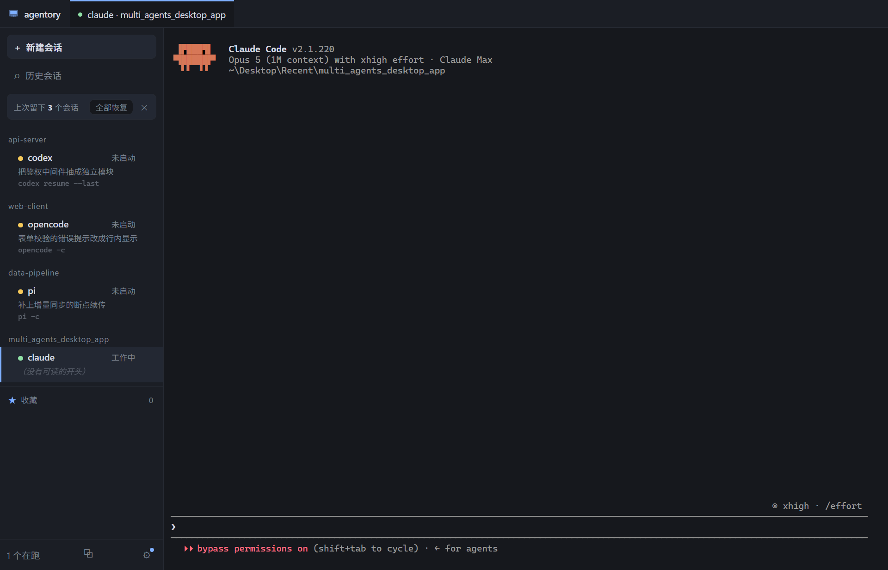

# agentory

A cross-agent session workbench for Windows. It collects the coding-agent sessions that
are currently scattered across a dozen terminal windows into one window, and brings them
back after a reboot.

Works with **Claude Code**, **Codex**, **OpenCode**, **Pi** and **Grok Build**.



## The problem

If you run more than one coding agent, your sessions live in a pile of terminal windows.
There is no list of them, no way to tell which one is which, and when the machine reboots
they are gone — the transcripts survive on disk, but finding and resuming the right one
means remembering a session id you never saw.

Every agent solves this for itself and only for itself. Nothing spans them.

## What it does

**Indexes every session across all five agents.** Reads each agent's own storage
directly — no daemon, no database, no background sync. A full scan of 435 sessions takes
about 670 ms on the development machine.

**Resumes them.** Each agent's resume command was verified by hand against the real CLI,
because the differences are not guessable: Codex is the only one that uses a subcommand
(`codex resume <id>`), and two of the five have a `--session-id` flag whose real meaning is
*create if missing* — using it to resume silently opens an empty session instead of failing.

**Keeps a workspace across restarts.** Sessions you add stay listed after you close the
app. Reopening offers to bring them all back; nothing is restarted without you asking,
because restarting an agent session costs tokens.

**Summarises each session.** One sentence saying what the session was about, so you can
tell two `a3f9c1e2` apart. This is **off by default and needs your own DeepSeek API key** —
it is the only feature that sends **your content** anywhere, so it is a deliberate,
separate switch. Before you enable it, the settings panel will show you the **exact text
that would be sent** for one of your own sessions.

Tool output is excluded structurally — the payload only keeps `text` parts, and your source
code lives in tool results. With summaries off, every row falls back to the first
informative message from the session, which is readable for about 90% of them.

**Shows each agent's version, and whether a newer one exists.** Reading the installed
version is a pure file read — agentory never starts an agent process to ask. Checking for
a newer version does reach the network (npm's registry, and x.ai for Grok), but the only
thing sent is a package name; no session content is involved. It is on by default and can
be switched off.

**agentory never updates an agent for you.** It shows you the command and you run it. That
is not caution for its own sake: an early probe of ours pressed Enter on Codex's "update
now?" dialog and uninstalled it.

**Shows which skills and MCP servers each agent has, and moves skills between them.**
One row per skill, one column per agent, one click to install or uninstall. Installing
copies the directory; uninstalling moves it to the Recycle Bin, so it is always
recoverable and never asks you to confirm. Both global and per-project scopes.

MCP servers are **shown but not edited** — the same matrix marks which are configured,
which are switched off in the config, which agent does not support MCP at all, and which
configs store a credential in plaintext. Editing those files means format-preserving
writes and racing the agent that owns them; that is a different risk class.

This never reads a credential's value — only field names. Nothing is cached, so nothing
is written to a second place.

### Reading a session's working directory

Two of the five agents encode the project path into a directory name lossily, so
`local_GPU` and `local-GPU` become the same string on disk. The real working directory is
therefore always read from the session's own content, never reconstructed from the folder
name. Every path the app displays has been checked for existence before it is offered as
something you can resume.

## Install

Download the latest release and run it. Two forms are published:

| File | What it is |
|---|---|
| `agentory-<version>-x64.exe` | Installer. Installs for the current user, no administrator rights needed. |
| `agentory-<version>-portable.exe` | Single file, no installation. Slower to start, since it unpacks itself each time. |

Both store their data in `%APPDATA%\agentory`, so you can switch between them without
losing your workspace.

### Windows will warn you the first time

agentory is not code-signed, so Windows shows **"Windows protected your PC — Unknown
publisher"** on first run. Click **More info**, then **Run anyway**.

This is expected for an unsigned open-source build. SmartScreen is a reputation service:
signing does not remove the warning, it only lets a reputation accumulate over time, and a
certificate costs a few hundred dollars a year. If that trade ever makes sense for this
project it will be revisited.

## Build from source

Requires Node.js 22+ and Windows.

```bash
npm install
npm run dev        # run in development
npm test           # unit tests plus real-machine checks against your own agents
npm run package    # build the installer and the portable exe into release/
```

`npm test` includes tests that spawn your real agent CLIs and read your real session
files. They skip themselves when the thing they need is not present, rather than passing
vacuously.

## Status

Working: session index, resume, workspace persistence, favourites, session summaries,
agent version checks, a cross-agent skills/MCP matrix with skill install/uninstall,
themes, keyboard shortcuts, terminal-bell notifications.

Not built yet:

- **Auto-update.** There is no release feed yet, so there is nothing to update from.
- **Split panes.** One session is visible at a time; switching is by tab or `Ctrl+Tab`.

Known limitations:

- A session created inside agentory cannot be added to favourites until it has an id, and
  agents only assign one after the session starts.
- Opening the history dialog takes **1–2 seconds** on a 437-session corpus. agentory
  deliberately keeps no index database and rescans instead; that decision needs revisiting
  as corpora grow.
- Summaries skip OpenCode sessions, because OpenCode already stores a model-generated
  title that is better than what we would produce.
- The "what's new" link is derived from the package's own registry metadata, so it is
  missing for OpenCode (whose metadata lists neither a repository nor a homepage) and for
  Grok (not distributed through npm). Those rows still show versions and an update command.

## Keyboard shortcuts

Application actions all live under `Ctrl+Shift`. This is deliberate: the main area is a
terminal, and `Ctrl+W`, `Ctrl+A`, `Ctrl+E` and `Ctrl+C` all mean something to the agent
running inside it. Taking those keys would be a real loss of function, so they are passed
through untouched. Press `F1` for the full list.

## Design notes

`DESIGN.md` records the decisions and, more usefully, the measurements behind them — why
there is no index database, why the terminal is treated as a bought black box, why session
identity is the agent's own id rather than a name we invent. `docs/research-notes.md` is
the investigation that preceded the code.

## License

MIT
